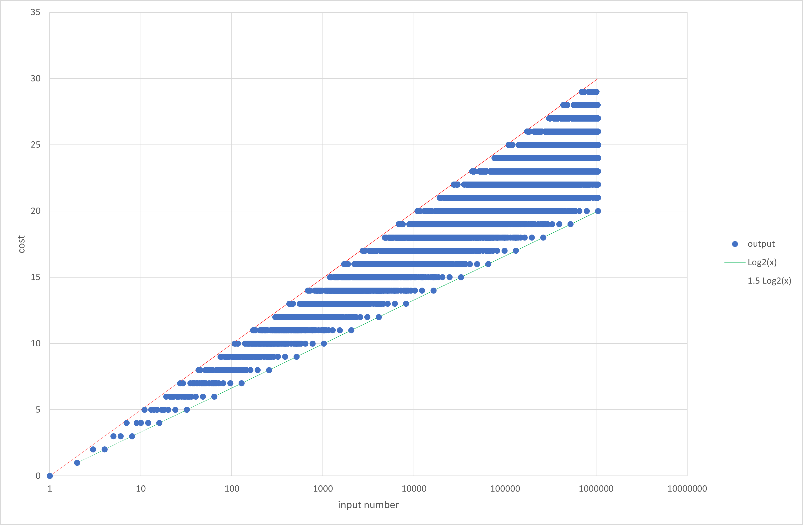

# Problem description

P(T)Vzzle – 2022-01-01
You have a lot of Christmas cakes – oh wtf I’ve just discovered now the English version of the word “Panettone” … a cake? Mah – and you are allowed to perform only the following operations:
-	Add 1 xMas cake
-	Remove 1 xMas cake
-	Divide the entire group by 2 (ONLY IF you have an even number of xMAS cakes)

Find a function that given the total beginning amount of xMAS cakes as a string containing up to 309 digits, will provide the minimum number of operations you need to reduce your starting group to 1 (example: you are given 8 xMas cakes, so halving 3 times you get 1)

# Install .NET 6

## Windows
Run dotnet-install.ps1

## Linux/Mac
Run dotnet-install.sh

# Execute
cd PtVzzlexMasCake

dotnet run -- \<value\>

the value must be a positive integer (arbitrarily large)

## Output
A text file named "output.txt" with the following format:

The first line is the input value

From the second line there is the sequence of operations needed to reach the result "one",
one operation per line.

the operation are:

- Sub: current value - 1

- Add: current value + 1

- Div: current value / 2

the operations must be performed in sequence.

Solution examples (files with the "#.expected.txt" pattern) are provided in the PtVzzlexMasCake.Tests\Resources\ directory.

## Tests
cd PtVzzlexMasCake.Tests
dotnet test

## Remarks!
No demonstration that the result is correct is provided, 
but the algorithm was tested for numbers up to 2 ^ 20 against a completely different mothodology, 
and the two methodologies provide solutions with the same cost 
(even if not always the same solutions as multiple optimal exist for a given input).

## Worst case scenario


The worst case is for numbers needing one "Add" or "Sub" operation every two "Div" operations, meaning 1.5 Log2(N) operations (the best case scenarion is obviously log2(N) operations).

for example the number 699051 requires the folloqing sequence to reach one:

```
Add
Div
Div
Add
Div
Div
Add
Div
Div
Add
Div
Div
Add
Div
Div
Add
Div
Div
Add
Div
Div
Add
Div
Div
Add
Div
Div
Sub
Div
```
## Solution graph form numbers up to 64

