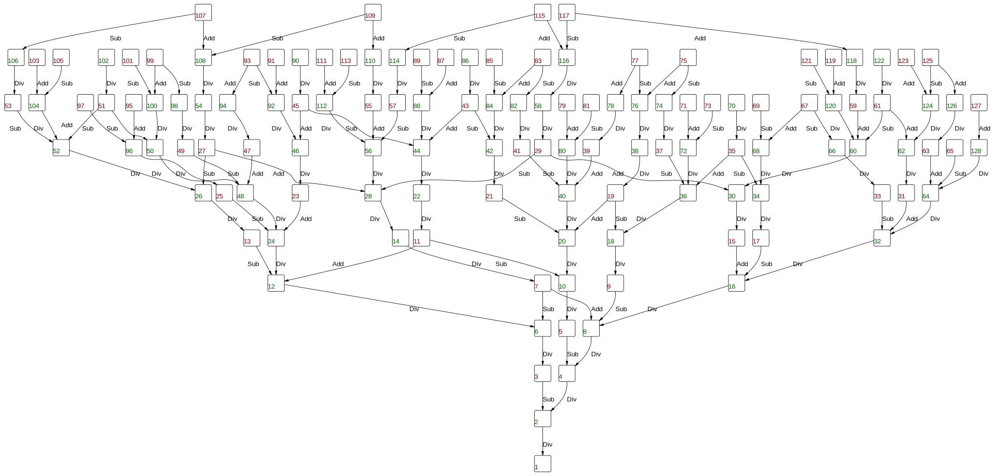

# Problem description

P(T)Vzzle – 2022-01-01
You have a lot of Christmas cakes – oh wtf I’ve just discovered now the English version of the word “Panettone” … a cake? Mah – and you are allowed to perform only the following operations:
-	Add 1 xMas cake
-	Remove 1 xMas cake
-	Divide the entire group by 2 (ONLY IF you have an even number of xMAS cakes)

Find a function that given the total beginning amount of xMAS cakes as a string containing up to 309 digits, will provide the minimum number of operations you need to reduce your starting group to 1 (example: you are given 8 xMas cakes, so halving 3 times you get 1)

# Install .NET 6

## Windows
Run dotnet-install.ps1

## Linux/Mac
Run dotnet-install.sh

# Execute
cd PtVzzlexMasCake

dotnet run -- \<value\>

the value must be a positive integer (arbitrarily large)

if no argument is passed, a random number with 309 digits is used.

## Output
A text file named "output.txt" with the following format:

The first line is the input value

From the second line there is the sequence of operations needed to reach the result "one",
one operation per line.

the operation are:

- Sub: current value - 1

- Add: current value + 1

- Div: current value / 2

the operations must be performed in sequence.

Solution examples (files with the "#.expected.txt" pattern) are provided in the PtVzzlexMasCake.Tests\Resources\ directory.

## Tests
cd PtVzzlexMasCake.Tests
dotnet test

## Remarks!
No demonstration that the result is correct is provided, 
but the algorithm was tested for numbers up to 2 ^ 20 against a completely different mothodology, 
and the two methodologies provide solutions with the same cost 
(even if not always the same solutions as multiple optimal exist for a given input).

## Worst case scenario


The worst case is for numbers needing one "Add" or "Sub" operation every two "Div" operations, meaning 1.5 Log2(N) operations (the best case scenarion is obviously log2(N) operations).

for example the number 699051 requires the folloqing sequence to reach one:

```
Add
Div
Div
Add
Div
Div
Add
Div
Div
Add
Div
Div
Add
Div
Div
Add
Div
Div
Add
Div
Div
Add
Div
Div
Add
Div
Div
Sub
Div
```
## Solution graph (ALL efficient solutions displayed) form numbers up to 128


## Optimized implementation
The class [BinaryPuzzleSolver](PtVzzlexMasCake/BinaryPuzzleSolver.cs) contains an optimized implementation of the algorithm, up to five time faster than the standard one.

the following benchmark can be executed calling 

dotnet run -- -benchmark

from the PtVzzlexMasCake directory.

``` ini

BenchmarkDotNet=v0.13.1, OS=Windows 10.0.17134.2087 (1803/April2018Update/Redstone4)
Intel Core i7-4702MQ CPU 2.20GHz (Haswell), 1 CPU, 8 logical and 4 physical cores
.NET SDK=6.0.101
  [Host]     : .NET 6.0.1 (6.0.121.56705), X64 RyuJIT
  DefaultJob : .NET 6.0.1 (6.0.121.56705), X64 RyuJIT


```
|             Method | Digits |         Mean |      Error |     StdDev |       Median | Ratio | RatioSD |
|------------------- |------- |-------------:|-----------:|-----------:|-------------:|------:|--------:|
|       **PuzzleSolver** |      **8** |     **1.404 μs** |  **0.0275 μs** |  **0.0283 μs** |     **1.395 μs** |  **1.00** |    **0.00** |
| BinaryPuzzleSolver |      8 |     1.559 μs |  0.0176 μs |  0.0156 μs |     1.552 μs |  1.11 |    0.03 |
|                    |        |              |            |            |              |       |         |
|       **PuzzleSolver** |     **16** |     **4.319 μs** |  **0.0479 μs** |  **0.0400 μs** |     **4.306 μs** |  **1.00** |    **0.00** |
| BinaryPuzzleSolver |     16 |     3.357 μs |  0.1529 μs |  0.4508 μs |     3.617 μs |  0.71 |    0.10 |
|                    |        |              |            |            |              |       |         |
|       **PuzzleSolver** |     **32** |    **12.442 μs** |  **0.1568 μs** |  **0.1390 μs** |    **12.412 μs** |  **1.00** |    **0.00** |
| BinaryPuzzleSolver |     32 |     8.435 μs |  0.1663 μs |  0.2103 μs |     8.328 μs |  0.68 |    0.02 |
|                    |        |              |            |            |              |       |         |
|       **PuzzleSolver** |     **64** |    **34.522 μs** |  **0.4016 μs** |  **0.3560 μs** |    **34.504 μs** |  **1.00** |    **0.00** |
| BinaryPuzzleSolver |     64 |    17.982 μs |  0.2681 μs |  0.2377 μs |    17.919 μs |  0.52 |    0.01 |
|                    |        |              |            |            |              |       |         |
|       **PuzzleSolver** |    **128** |   **119.000 μs** |  **2.3538 μs** |  **2.4172 μs** |   **118.719 μs** |  **1.00** |    **0.00** |
| BinaryPuzzleSolver |    128 |    47.461 μs |  1.3434 μs |  3.9610 μs |    45.496 μs |  0.43 |    0.02 |
|                    |        |              |            |            |              |       |         |
|       **PuzzleSolver** |    **256** |   **395.070 μs** |  **7.7771 μs** |  **7.9865 μs** |   **394.613 μs** |  **1.00** |    **0.00** |
| BinaryPuzzleSolver |    256 |   116.538 μs |  0.5222 μs |  0.4361 μs |   116.418 μs |  0.29 |    0.01 |
|                    |        |              |            |            |              |       |         |
|       **PuzzleSolver** |    **512** | **1,425.209 μs** |  **8.6258 μs** |  **7.2029 μs** | **1,421.555 μs** |  **1.00** |    **0.00** |
| BinaryPuzzleSolver |    512 |   335.446 μs |  2.9785 μs |  2.4872 μs |   334.431 μs |  0.24 |    0.00 |
|                    |        |              |            |            |              |       |         |
|       **PuzzleSolver** |   **1024** | **5,520.100 μs** | **44.6069 μs** | **37.2488 μs** | **5,528.209 μs** |  **1.00** |    **0.00** |
| BinaryPuzzleSolver |   1024 | 1,023.062 μs |  4.5211 μs |  3.5298 μs | 1,021.721 μs |  0.19 |    0.00 |
